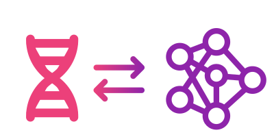

# EIR-auto-GP

<p align="center">
  
</p>

<p align="center">
  <a href="LICENSE" alt="License">
        </a>
  
  <a href="https://www.python.org/downloads/" alt="Python">
        </a>
  
  <a href="https://pypi.org/project/eir-auto-gp/" alt="Python">
        </a>
  
  
  <a href="https://codecov.io/gh/arnor-sigurdsson/EIR-auto-GP" > 
        </a>
  
  <a href='https://eir-auto-gp.readthedocs.io'>
    </a>
      
</p>

---

`EIR-auto-GP`: Automated genomic prediction (GP) using deep learning models with EIR.

**WARNING**: This project is in alpha phase. Expect backwards incompatible changes and API changes.

**NOTE**: This project is specifically for genomic prediction. For more general and configurable deep learning tasks, please refer to [EIR](https://github.com/arnor-sigurdsson/EIR).

## Overview

EIR-auto-GP is a comprehensive framework for genomic prediction (GP) tasks, built on top of the [EIR](https://github.com/arnor-sigurdsson/EIR) deep learning framework. EIR-auto-GP streamlines the process of preparing data, training, and evaluating models on genomic data, automating much of the process from raw input files to results analysis. Key features include:

- Support for `.bed/.bim/.fam` PLINK files as input data.
- Automated data processing and train/test splitting.
- Takes care of launching a configurable number of deep learning training runs.
- SNP-based feature selection based on GWAS, deep learning-based attributions, and a combination of both.
- Ensemble prediction from multiple training runs.
- Analysis and visualization of results.

## Installation

First, ensure that [plink2](https://www.cog-genomics.org/plink/2.0/) is installed and available in your `PATH`. 

Then, install `EIR-auto-GP` using `pip`:

`pip install eir-auto-gp`

**Important:** The latest version of EIR-auto-GP supports [Python 3.12](https://www.python.org/downloads/). Using an older version of Python will install a outdated version of EIR-auto-GP, which likely be incompatible with the current documentation and might contain bugs. Please ensure that you are installing EIR-auto-GP in a Python 3.12 environment.


## Usage

Please refer to the [Documentation](https://eir-auto-gp.readthedocs.io/en/latest/) for examples and information.

## Workflow

The rough workflow can be visualized as follows:

<p align="center">
  
</p>

1. Data processing: EIR-auto-GP processes the input `.bed/.bim/.fam` PLINK files and `.csv` label file, preparing the data for model training and evaluation.
2. Train/test split: The processed data is automatically split into training and testing sets, with the option of manually specifying splits.
3. Training: Configurable number of training runs are set up and executed using EIR's deep learning models.
4. SNP feature selection: GWAS based feature selection, deep learning-based feature selection with Bayesian optimization, and mixed strategies are supported.
5. Test set prediction: Predictions are made on the test set using all training run folds.
6. Ensemble prediction: An ensemble prediction is created from the individual predictions.
7. Results analysis: Performance metrics, visualizations, and analysis are generated to assess the model's performance.

## Citation

If you use `EIR-auto-GP` in a scientific publication, we would appreciate if you could use one of the following citations:

- [Deep integrative models for large-scale human genomics](https://academic.oup.com/nar/article/51/12/e67/7177885)
- [Non-linear genetic regulation of the blood plasma proteome](https://www.medrxiv.org/content/10.1101/2024.07.04.24309942v1)
- [Improved prediction of blood biomarkers using deep learning](https://www.medrxiv.org/content/10.1101/2022.10.27.22281549v1)

```
@article{10.1093/nar/gkad373,
    author    = {Sigurdsson, Arn{\'o}r I and Louloudis, Ioannis and Banasik, Karina and Westergaard, David and Winther, Ole and Lund, Ole and Ostrowski, Sisse Rye and Erikstrup, Christian and Pedersen, Ole Birger Vesterager and Nyegaard, Mette and DBDS Genomic Consortium and Brunak, S{\o}ren and Vilhj{\'a}lmsson, Bjarni J and Rasmussen, Simon},
    title     = {{Deep integrative models for large-scale human genomics}},
    journal   = {Nucleic Acids Research},
    month     = {05},
    year      = {2023}
}

@article{sigurdsson2024non,
  title={Non-linear genetic regulation of the blood plasma proteome},
  author={Sigurdsson, Arnor I and Gr{\"a}f, Justus F and Yang, Zhiyu and Ravn, Kirstine and Meisner, Jonas and Thielemann, Roman and Webel, Henry and Smit, Roelof AJ and Niu, Lili and Mann, Matthias and others},
  journal={medRxiv},
  pages={2024--07},
  year={2024},
  publisher={Cold Spring Harbor Laboratory Press}
}

@article{sigurdsson2022improved,
    author    = {Sigurdsson, Arnor Ingi and Ravn, Kirstine and Winther, Ole and Lund, Ole and Brunak, S{\o}ren and Vilhjalmsson, Bjarni J and Rasmussen, Simon},
    title     = {Improved prediction of blood biomarkers using deep learning},
    journal   = {medRxiv},
    pages     = {2022--10},
    year      = {2022},
    publisher = {Cold Spring Harbor Laboratory Press}
}
```
