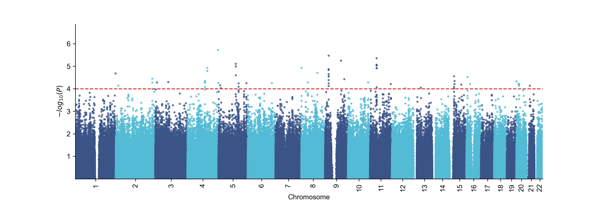
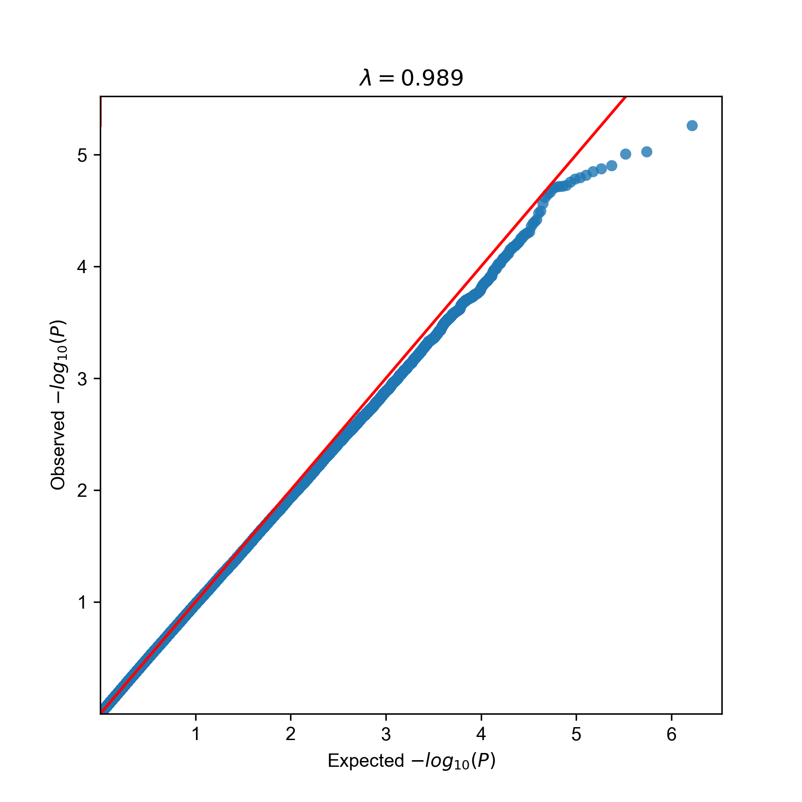
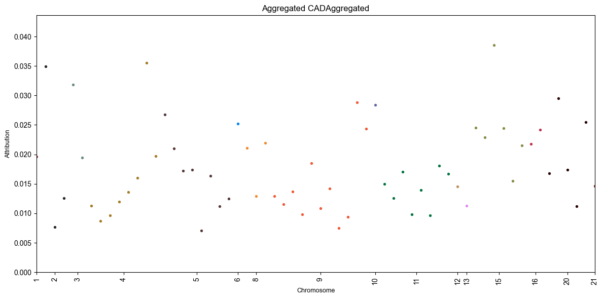
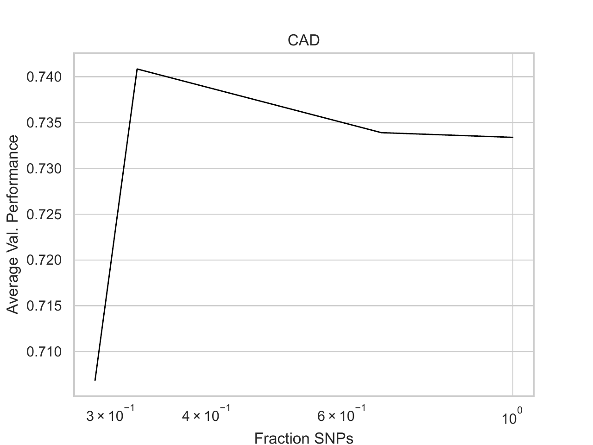

.. _01-basic-tutorial:

01 – Genomic Prediction for Coronary Artery Disease
=========================================================================

A - Setup
^^^^^^^^^

In this tutorial,
we will be using ``EIR-auto-GP``,
to train deep learning models for
predicting coronary artery disease (CAD) risk
based on genotype data and a mix of
categorical and continuous tabular inputs (i.e., clinical data).

We will be working with data from the `PennCATH study`_,
(here the data obtained gotten from `this`_ excellent GWAS tutorial),
which investigates genetic risk factors for coronary artery disease.
To start, please download the `processed PennCATH data`_
(or process your own `.bed`, `.bim`, `.fam` files using EIR-auto-GP).
The same approach can be applied to other cohorts and diseases,
such as the `UK Biobank`_ for other complex trait predictions.

.. _PennCATH study: https://www.thelancet.com/journals/lancet/article/PIIS0140-6736(10)61996-4/fulltext
.. _this: https://pbreheny.github.io/adv-gwas-tutorial/index.html
.. _processed PennCATH data: https://drive.google.com/file/d/15Kgcxxm1CntoxH6Gq7Ev_KBj24izKg3p
.. _UK Biobank: https://www.nature.com/articles/s41586-018-0579-z

First, let's set up our folders:

.. code-block:: console

    $ mkdir -p eir_auto_gp_tutorials/01_basic_tutorial/data
    $ mkdir -p eir_auto_gp_tutorials/tutorial_runs/01_basic_tutorial

Now, the downloaded data should have the following structure:

.. literalinclude:: ../tutorial_files/01_basic_tutorial/commands/input_folder.txt
    :language: console

Examining the data,
we can see that we are working with 861473 SNPs (``.bim`` file)
and 1401 individuals (``.fam`` file).

Looking at the corresponding ``penncath.csv`` file, we can see the
labels for each individual.

.. literalinclude:: ../tutorial_files/01_basic_tutorial/commands/label_file.txt
    :language: console

.. important::

    The label file ID column must be called "ID" (uppercase).

So, here we can see the CAD status
we want to predict (with 1 being CAD positive),
but we also have some more information about the individuals.
Namely, we have
sex, age,
tg (triglycerides), hdl (high density lipoprotein) and ldl (low density lipoprotein).

Before diving into the model training,
we'll first have a quick look at the ``eir_auto_gp`` command line interface.

.. literalinclude:: ../tutorial_files/01_basic_tutorial/commands/eirautogp_help.txt
    :language: console

That's a whole lot of text, but don't worry -
we're not going to read the entire encyclopedia
before we start training a couple of models.

B - Training
^^^^^^^^^^^^

Now that we have set up our data,
and had a quick look at
the ``eir_auto_gp`` command line interface,
we can start training. So just to review,
we are going to train a model to predict CAD risk,
using genotype and clinical data as inputs to our models.

First, let's look at the command we will use to train our model:

.. literalinclude:: ../tutorial_files/01_basic_tutorial/commands/AUTO_1.txt
    :language: console

Now, the first options are pretty self-explanatory – they mainly have to do with
the input data and the output directory. Let's take a quick look at some of the
more esoteric options and the reasoning behind them:

1. ``--folds 0-2``: This option specifies the folds to run during cross-validation.
The train/validation split is randomly performed for each fold.
In this tutorial, we're running 3 folds (0, 1, and 2)
for training and validation.
Increasing the number of folds might help us get a more stable estimate of the
model's performance, but it will also increase the runtime.

2. ``--feature_selection gwas->dl``: This option specifies the feature selection
strategy to use for SNP selection.
In this case, we're using a two-step approach (gwas->dl)
that first performs feature selection using GWAS p-values
and then refines the selection using a deep learning (DL) importance method.
You might have noticed above that we had 861473 SNPs in our dataset, but
only 1401 individuals,
this means that we might have relatively big :math:`p \gg n`, problem. Therefore,
filtering the SNPs down first with a GWAS p-value threshold
(``--gwas_p_value_threshold 1e-4``) can help reduce overfitting and greatly improve
runtime.

3. ``--n_dl_feature_selection_folds 1``: This option sets the number of folds
to run DL feature importance calculation on
genotype data before using the results for feature selection in subsequent models.
In this case, the DL feature importance calculation is run on the first fold
after the GWAS feature selection step. If using ``--feature_selection dl``,
the DL feature importance calculation is performed on the full set of SNPs.

4. ``--do_test``: This option, when set, instructs the program to
run the test set prediction. Generally we would set this option after everything
is finalized and we want to get a final estimate of the model's performance. In
this tutorial, we'll go ahead and just set it from the beginning.

Now, after this relatively dry explanation of the options (apologies),
let's go ahead and run the training. Running the command above took around 8
minutes on my laptop using a CPU. But then again the GWAS filtered the SNPs
down to a manageable number.

.. note::
    Some of the settings above (e.g. ``n_dl_feature_selection_folds`` and
    ``gwas_p_value_threshold``) can be tinkered with, but remember to then
    turn off the ``--do_test`` option, as the test set is only used for
    final model evaluation.

.. note::
    Here we are using the `gwas->dl` feature selection strategy,
    but it might well be that using e.g. a purely GWAS based one,
    such as the `gwas+bo` is faster and/or more accurate.

Now running this will produce a pretty crazy amount of output
to the terminal, but don't worry, we'll go through it all.
Assuming that everything went well, we should have a new folder in our
``eir_auto_gp_tutorials`` directory called ``tutorial_runs/01_basic_tutorial``:

.. literalinclude:: ../tutorial_files/01_basic_tutorial/commands/tutorial_folder.txt
    :language: console

We will go through these in the order of
``data -> modelling -> feature_selection -> analysis``.

C - Data Output
^^^^^^^^^^^^^^^

.. figure:: ../../source/_static/img/eir_auto_gp-data.svg
    :align: center

    The data processing pipeline. Starting with a Plink binary fileset
    and a tabular label file, the data is split into a train and test set,
    either randomly or according to a pre-specified split. The data is then
    processed and organized on the disk, ready to be read by the ``EIR``
    framework for model training. Prior to the full training pipeline,
    one can pre-filter the SNPs using a GWAS p-value threshold, with
    the ``eirautogwas`` command line interface.

|

The ``data`` folder contains the parsed genotype and tabular data,
split into train and test sets. There is not much more to say about this folder,
besides perhaps that you can have a look at the ``ids`` folder to see
how the IDs have been split into train and test sets.

.. note::
    You can configure the exact train and test split by using the
    ``--pre-split-folder`` option. This option takes a folder containing
    ``train_ids.txt`` and ``test_ids.txt`` files, where each file contains
    a list of IDs to be used for training and testing respectively (one ID per
    line). The default is a 90/10 train/test set split.

.. warning::
    The default approach is to drop samples that have NA values in
    any of the columns (missing genotype data is supported). If you want to
    keep samples with missing tabular data, please impute them first (with values
    based on the training set) and then use the ``--pre-split-folder`` option.

.. note::
    When running on large datasets, it might take a while for the data to be
    processed. However, the data only has to be processed once, and then
    subsequent runs can reuse the processed data. The data processing speed
    might be optimized in the future.

D - Modelling Output
^^^^^^^^^^^^^^^^^^^^

.. figure:: ../../source/_static/img/eir_auto_gp-model.svg
    :align: center

    The modelling and feature selection part of the pipeline.
    The training and validation data are used to train and evaluate
    the DL models. If GWAS is also used for feature selection (using the
    ``--feature_selection gwas->dl`` option), the GWAS p-values are used
    to filter the SNPs before the any DL models are trained. A set of :math:`F`
    (controlled by the ``--n_dl_feature_selection_folds`` option)
    DL models are trained on the full set of SNPs
    (where "full" refers to either the full SNP set
    or the SNP set after GWAS filtering if that option was specified).
    The :math:`F` models are then used to calculate the importance of each SNP
    using the DL feature importance / attribution method in `EIR`_. If DL is
    used for feature selection
    (using the ``dl`` or ``gwas->dl`` value for ``--feature_selection`` option),
    the SNPs are iteratively pruned using Bayesian optimization w.r.t validation
    set performance.

This folder contains the `EIR`_ runs for each fold. See the `EIR`_ documentation
and `this example tutorial`_ for more information about the output and how
it is generated. Feel free to poke around in these folders to see what's going on,
for example you can see
train/validation learning curves,
confusion matrices,
what the DL neural network architecture looks like,
the configurations used for training,
and the model's predictions on the test set.
Again, please refer to the `EIR`_ documentation
for more information.

.. _EIR: https://github.com/arnor-sigurdsson/EIR
.. _this example tutorial: https://eir.readthedocs.io/en/latest/tutorials/01_basic_tutorial.html

E - Feature Selection Output
^^^^^^^^^^^^^^^^^^^^^^^^^^^^

First, let's take a closer look at what the ``feature_selection`` folder contains:

.. literalinclude:: ../tutorial_files/01_basic_tutorial/commands/feature_selection_folder.txt
    :language: console

Now, we included a GWAS step in our feature selection,
so we have a ``gwas_output`` folder containing the GWAS results
as well as a couple of plots, namely a manhattan plot and a QQ plot.

.. note::
    The significance threshold in the manhattan plot reflects what is set
    by the ``--gwas_p_value_threshold`` option.

Now, since we used
a hybrid feature selection strategy (``gwas->dl``),
we also have a ``dl_importance`` folder
containing the DL feature importance results.
One of these files is a manhattan like
plot for the DL feature importance / attributions:

This plot is definitely quite sparse, especially compared to the GWAS manhattan
plot above! This is because we only trained the DL models on the SNPs that passed
the GWAS p-value threshold from before.

.. note::
    The y-axis here represents the average attribution / feature importance
    (more specifically, the effect of the SNP on the model's prediction)
    across all folds. You can get more information about the specific SNPs
    and their attributions in the ``dl_attributions.csv`` file.

F - Analysis Output
^^^^^^^^^^^^^^^^^^^

.. figure:: ../../source/_static/img/eir_auto_gp-test.svg
    :align: center

    The analysis and test set prediction part of the pipeline.
    The framework gathers the
    validation performance results compiles them into a single ``.csv`` and
    as well as an overview figure of the DL feature importance results if
    applicable.
    If the ``--do_test`` option is specified,
    the trained DL models from each fold
    are used to make predictions on the test set,
    which are reported in the ``analysis`` folder as well as an ensemble
    prediction.

Finally, let's take a look at the ``analysis`` folder:

.. literalinclude:: ../tutorial_files/01_basic_tutorial/commands/analysis_folder.txt
    :language: console

We will first take a look at the validation performance results:

.. csv-table:: Validation performance
   :file: ../tutorial_files/01_basic_tutorial/figures/CAD_validation_results.csv
   :header-rows: 1
   :widths: 10, 10, 10, 10, 10, 10, 10, 10, 10

.. note::
    The best average performance is according to the defaults in ``EIR``,
    which is average of MCC, ROC-AUC and average precision (AP)
    for categorical targets and
    1.0-LOSS, PCC, R2
    for continuous targets.

The DL feature selection method uses Bayesian optimization to
select the fraction of SNPs to use, we can see the best average validation
performance as a function of the fraction of SNPs used:

|

Now, the results do not change much between trials, perhaps because we have
already filtered the SNPs using GWAS.

In any case, now let's finally take a look at the test set performance:

.. csv-table:: Test set performance
   :file: ../tutorial_files/01_basic_tutorial/figures/CAD_test_results.csv
   :header-rows: 1

So here we can see that the validation performance seems to have been biased,
which makes sense considering it was quite small, and we were seeing some
fluctuations between folds. We can see the test set predictions for the individual
folds, as well as an ensemble of all the folds.

If you read this far, thank you for your patience! Hopefully you found this
tutorial useful!

Appendix – Validation Set Strategy
^^^^^^^^^^^^^^^^^^^^^^^^^^^^^^^^^^

The default validation set strategy,
10% of the full training data
(with a lower threshold of 16-64,
depending on the dataset size,
and an upper threshold of 20,000)
is allocated for validation purposes,
while the remaining 90% is utilized for training.
This split is consistently maintained across all folds,
ensuring that the validation set size remains constant.
This approach not only contributes to the model training process
but also plays a role in the execution of GWAS.
Specifically, GWAS is applied exclusively to the training set.

Alternatively, you can opt for an approach
that involves randomly splitting the full training data into
training and validation sets during each fold.
This method, which can be activated by
setting the ``--no-freeze-validation-set`` option,
allows for independent data splits in each fold.
Consequently, the validation set differs for every fold,
providing a more varied evaluation of the model's performance.

.. literalinclude:: ../tutorial_files/01_basic_tutorial/commands/AUTO_2.txt
    :language: console
    :emphasize-lines: 12

However, as we no longer have a set training set,
the GWAS is applied to the full training data,
which includes the validation set.
Although this grants the GWAS access to more data,
it may result in overfitting concerning the validation set
(i.e., the GWAS feature selection has had access to the validation data).
While we still have the final test set to get an unbiased estimate of the
model's performance, the validation results may be less reliable.
This becomes less of a problem when using larger datasets,
but important to keep in mind when using smaller datasets.

We can see the results of this approach below:

.. csv-table:: Validation performance
   :file: ../tutorial_files/01_basic_tutorial/figures/CAD_validation_results_2.csv
   :header-rows: 1

.. csv-table:: Test set performance
   :file: ../tutorial_files/01_basic_tutorial/figures/CAD_test_results_2.csv
   :header-rows: 1

Notice how there is a bigger gap for most metrics
between the validation and test set performance
compared to the previous example, indicating
that the validation performance is less reliable.
This highlights the importance of separating our
data into training, validation and test sets. For example,
if one had simply applied a GWAS to the full dataset
and then used the top SNPs for training, validation and testing,
it is likely that the reported metrics would be overestimated.
