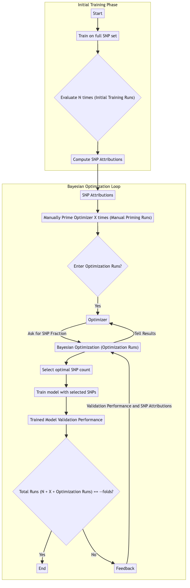
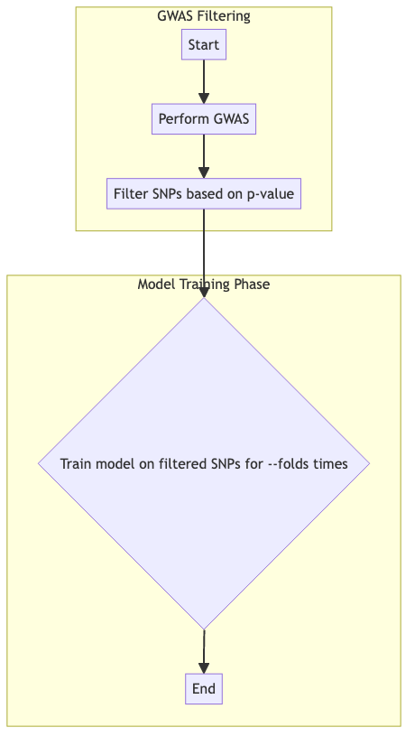
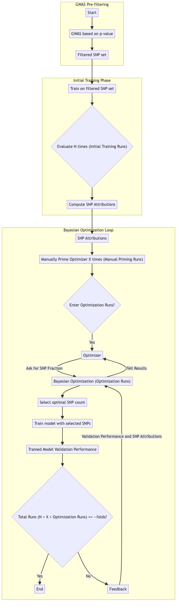
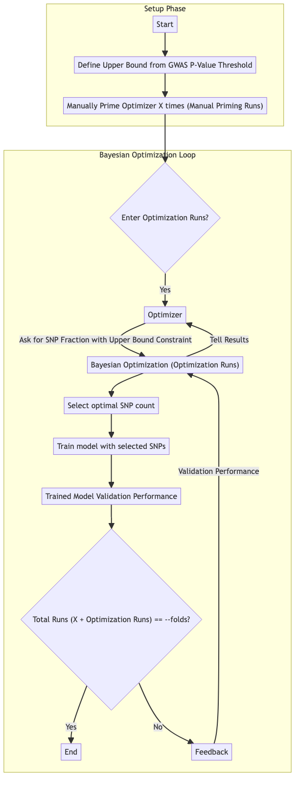
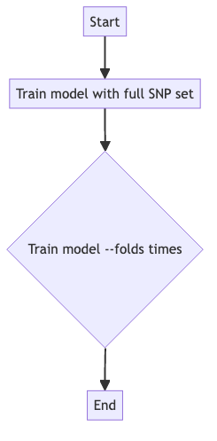

.. _feature-selection-methods:

Feature Selection Methods
=========================

EIR-auto-GP offers various feature selection methods for genomic prediction. Each method follows a unique workflow, as visualized and explained below.

DL Method
---------

The DL method uses deep learning models to compute SNP attributions, followed by a Bayesian optimization loop.

DL + GWAS Method
----------------

The DL + GWAS method combines deep learning SNP attributions with GWAS p-values for feature selection.

.. image:: ../source/_static/diagrams/feature_selection_methods/dl_gwas_method_diagram.png
   :align: center

GWAS Method
-----------

The GWAS method filters SNPs based on GWAS p-values without additional optimization.

GWAS -> DL Method
-----------------

This method first filters SNPs using GWAS p-values, then applies DL-based optimization.

GWAS + BO Method
----------------

The GWAS + BO method uses Bayesian optimization with GWAS p-values as an upper bound constraint.

None Method
-----------

The None method involves no feature selection, directly training models on the full SNP set.

